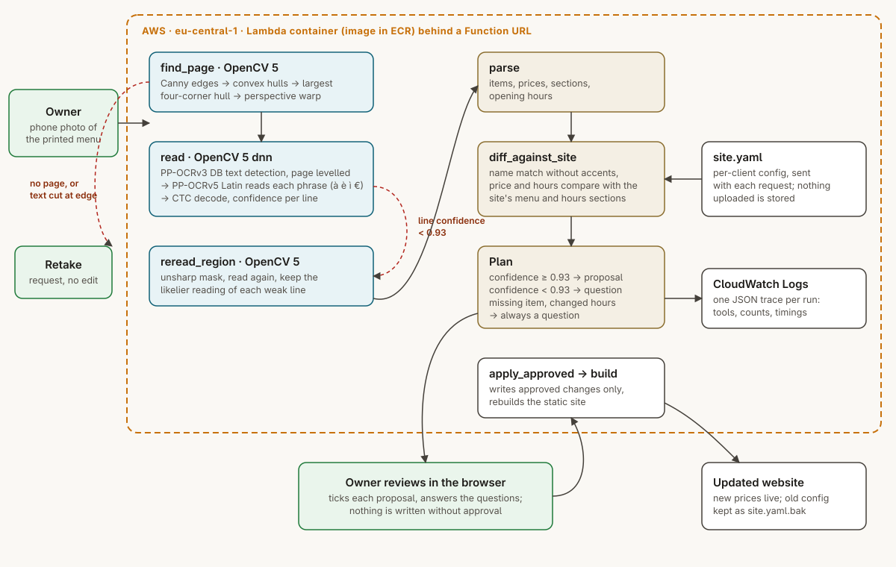

# Menu photo to website: technical report

OpenCV AI Competition 2026, Agentic Vision. Team exochard (Giuseppe Castelluccio), report of
2026-09-29. Every number below comes from a script in this repository and says which one.

- Live demo: https://rdnkmfzkqy6xfzvguayc3sneva0igvic.lambda-url.eu-central-1.on.aws/ (a
  synthetic menu and site are preloaded; "Upload your own" reads any photo)
- Code: https://github.com/exochard/menu-photo-to-website
- Video: https://vimeo.com/1231246365

## Problem and users

Small restaurants and bars in Italy change prices and opening hours on paper first: the
printed menu, the price list by the till, the sign on the door. Their website, when they
have one, lags weeks behind, and a customer who finds a pasta at 9 euro online and pays 11
at the table does not come back happy. The owner rarely has the time or the login to fix
it. They do have a phone.

The user is the owner. They photograph the printed menu; the system reads it, compares it
with the website, and shows each difference as a change they can approve or reject. The
site is rebuilt only from approved changes.

## What the system does

1. **find_page.** Canny edges, dilation, convex hulls, and the largest four-corner hull
   covering at least 15% of the photo; a perspective warp flattens it. Hulls rather than
   raw contours, because glare or a thumb breaks the page edge into an open contour with
   almost no area while its hull is still the page. No page found ends the run with a
   retake request.
2. **read.** OpenCV 5 `dnn`: the PP-OCRv3 DB text detector
   (`cv.dnn.TextDetectionModel_DB`) finds phrases; each phrase is split into words at
   vertical ink gaps; a CRNN (`cv.dnn.readNet`) recognises each word. Two fixes over the
   OpenCV Zoo wrapper mattered. Its CTC decoder marks blanks with "-", which is also a
   charset character, so "12:30-15:00" came back as "12:3015:00"; decoding by blank index
   keeps real hyphens. Short words stretched to the CRNN's 100x32 input repeat letters
   ("al" read as "all"), so narrow crops are padded with the paper colour instead. The
   CRNN emits log-probabilities; a word's confidence is the geometric mean of its per-step
   best probabilities, and a line's is its weakest word.
3. **reread_region.** When any line is under 0.95 confidence, the page is read again after
   an unsharp mask, and each weak line keeps the likelier of its two readings.
4. **parse.** Lines become sections, items with prices, opening hours and closing notes.
   The CRNN charset has no "€", so the sign comes back as a stray "6", "C" or "E" after the
   price and is discarded.
5. **diff_against_site.** Names are compared without accents or case (the charset is
   ASCII, so "Caffè" reads "Caffe") with a 0.8 similarity cut-off, then prices and hours are
   compared with the site's `menu` and `hours` sections.
6. **Plan.** A change read at 0.95 or more becomes a proposal. Anything weaker becomes a
   question. A dish on the site but not in the photo is always a question, because absence
   in a photo is weak evidence (a crease, a missed line). Changed hours are always a
   question too: the photo gives times without days.
7. **apply_approved and build.** Approved changes are written to the site's config (the
   old one kept as `.bak`) and the static site is rebuilt by a config-driven builder that
   escapes every client string.

What the camera measured decides the next step three times: page or retake, one read or
two, proposal or question.

## Architecture on AWS



- **Compute:** one AWS Lambda function from a container image
  (`public.ecr.aws/lambda/python:3.13`, 2048 MB, 60 s timeout), image stored in Amazon ECR.
- **Endpoint:** a Lambda Function URL serves the review page and two JSON routes,
  `POST /plan` and `POST /apply`.
- **State:** none on the server. The site config travels with each request and uploaded
  photos are never written to disk or storage.
- **Observability:** every plan logs one JSON line to CloudWatch Logs with the tool
  sequence, counts, status and timing.
- **Permissions:** the function's role has `AWSLambdaBasicExecutionRole` only (writing its
  own logs). It can read nothing else in the account.
- **Delivery:** `deploy.sh` creates or updates the repository, image, role, function and
  URL; `deploy.sh --down` removes them.

Measured on the live URL, 2026-09-28: a plan takes 7.6 s on a cold start and 3.4 to 4.8 s
warm (three warm runs); approval and rebuild take under 0.2 s. Rechecked 2026-09-29: three
warm runs took 4.2 s each end to end (3.8 s in the function).

## Evaluation

There is no public dataset of Italian menu photos with ground truth, so the evaluation uses
synthetic ones: `menuvision/synth.py` renders a random menu (sections, dishes, prices,
hours, a closing day), then photographs it on a table at a random angle, with uneven light, blur and sensor
noise. Three conditions, 30 photos each. Every parameter was tuned on seeds 0 to 99;
all numbers below use seeds from 1000.

**Reading** (`eval.py`, `out/eval-30.json`):

| Tilt, blur | Page found | Character error rate | Items exact (name and price) | Hours exact |
|---|---:|---:|---:|---:|
| 0.04, 0.6 | 30/30 | 0.061 | 161/195 (83%) | 30/30 |
| 0.08, 1.0 | 30/30 | 0.072 | 146/195 (75%) | 28/30 |
| 0.12, 1.6 | 29/30 | 0.154 | 76/195 (39%) | 21/30 |

**The agent, end to end** (`eval_agent.py`, `out/eval-agent-30*.json`). Each photo's site
config is its printed menu with two prices changed and one extra dish, so a perfect agent
proposes exactly 60 price changes per condition, asks about the extra dish, and proposes
nothing else.

| Tilt, blur | Price changes proposed | Without the re-read | Wrong proposals | Asked about the extra dish | Questions per photo | Retakes |
|---|---:|---:|---:|---:|---:|---:|
| 0.04, 0.6 | 54/60 | 49/60 | 0 | 30/30 | 1.40 | 0 |
| 0.08, 1.0 | 54/60 | 43/60 | 0 | 30/30 | 1.63 | 0 |
| 0.12, 1.6 | 36/60 | 28/60 | 0 | 28/30 | 3.27 | 2 |

The re-read is worth 5, 11 and 8 correct proposals per condition. No condition produced a
wrong proposal: when the reading was bad, the agent asked instead of editing. The cost of
that caution is the question count, which doubles under heavy blur.

**Failures, as measured.**

- Heavy blur is the weak spot: 39% of items exact, and 24 of the 60 changed prices end as
  questions or are missed.
- The two retakes under heavy blur are photos where the page edge was lost; the agent asked
  for a new photo rather than guessing.
- The confidence threshold is imperfect. On tuning seeds 0 to 39 it flags 55% of misread
  item lines and 13% of correctly read ones. A misread that the CRNN is sure of passes as a
  proposal; the owner's approval step is the guard for those.

## Limitations

- The evaluation is synthetic. Real menus have handwriting, chalkboards, two columns,
  decorative fonts and photos on laminated card; none of those is measured here.
- The recogniser's charset is ASCII: no accents and no "€". Names are matched without
  accents, so a read "Caffe" still matches the site's "Caffè", but a new dish is proposed
  without its accents.
- Hours are compared as time ranges only. The owner decides which days change.
- One page per photo; one menu section per site.
- The demo's Function URL is public and has no login, so anyone can make the function read
  a photo. It stores nothing and can reach nothing but its own logs; the account's Lambda
  concurrency limit (10, checked 2026-09-29) caps the load. A real
  deployment would put each owner's page behind a sign-in.

## Responsible use and human control

- Nothing reaches the website without the owner's approval of that specific change.
- Low confidence, a missing page, a missing dish and changed hours all become questions
  rather than edits.
- Uploaded photos are processed in memory and not stored. The public demo holds no
  personal data; its menu is synthetic.
- Client config is untrusted input: the site builder escapes every string it renders and
  whitelists what reaches CSS, and a test checks that a dish named `<script>` is rendered
  as text.
- The function's AWS role can only write its own logs.

## How it was built

I set the goal, the constraints (owner approval for every edit, no stored uploads, zero
spend) and the acceptance checks. The code, the evaluation scripts and this report were
drafted with an AI coding assistant (Claude Code), which also ran the measurements; I
reviewed the result before submitting it. Every number comes from the script named next to
it, and the failures are reported with the successes.

## Reproduce

```
python -m venv .venv && .venv/bin/pip install -r requirements.txt
./fetch_models.sh
.venv/bin/python -m pytest -q                    # 17 tests
.venv/bin/python eval.py --n 30                  # reading table
.venv/bin/python eval_agent.py --n 30            # agent table
.venv/bin/python eval_agent.py --n 30 --no-reread
.venv/bin/python webapp.py                       # http://localhost:8080
./deploy.sh                                      # AWS, after `aws login`
```
